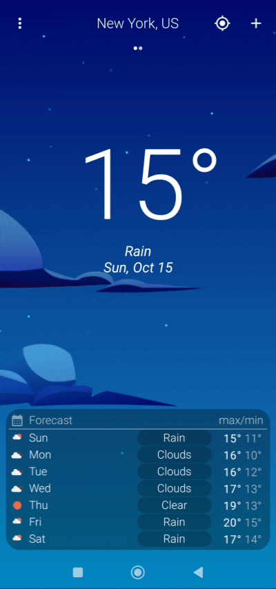
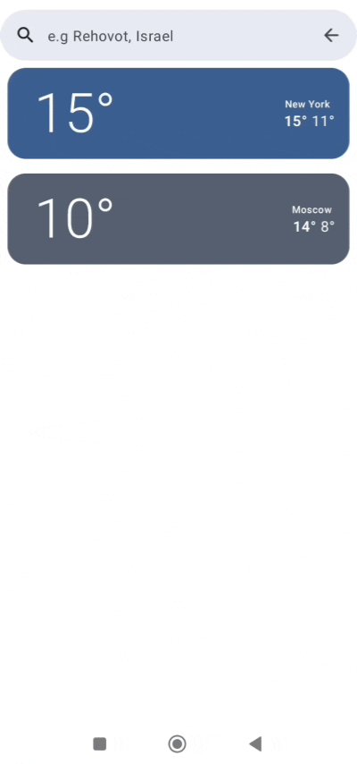
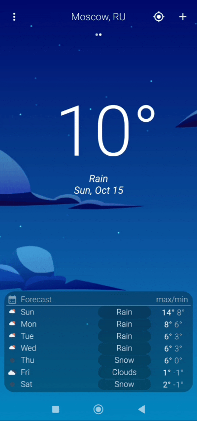

# MyWeatherApp
**MyWeatherApp** is a Android app built entirely with Kotlin and Jetpack Compose.

### Features
*   Get 7 days weather forecast for user current location with **1 click**.
*   Search 7 days weather forecast for any location on the globe.
*   Periodically synchronize weather data in the background.
*   Local data Pagination.

### Highlights
* **MVVM** architecture.
* **Hilt** Dependency injection.
* **WorkManger** executes sync job for keeping data up to date and showing status notification.
* **DataStore** for storing user preferred location.
* **ROOM** local database, includes: _one to many relationship_ and TypeConverters for saving weather forecasts and search history.
* **Location-Aware App** using GPS sensors/Last known location for fetching local forecast.
* **ConnectivityManager** Monitoring network connections. 

  
## Libraries & Dependencies
- [Hilt](https://developer.android.com/training/dependency-injection/hilt-jetpack) - Dependency injection library.
- [Kotlin Coroutines](https://developer.android.com/kotlin/coroutines) - Asynchronous programming.
- [Coil](https://coil-kt.github.io/coil/compose/) - Image loading.
- [RetroFit](https://square.github.io/retrofit/) - Type-safe REST client.
- [Room](https://developer.android.com/training/data-storage/room) - Saving data in a local database.
- [Navigation](https://developer.android.com/guide/navigation) - Navigation component.
- [Google Accompanist](https://github.com/google/accompanist) - Android runtime permissions support.
- [Google Play services location API](https://developer.android.com/training/location/retrieve-current) - getting user current location.
- [DataStore](https://developer.android.com/topic/libraries/architecture/datastore) - storing user preferred location.
- [WorkManager](https://developer.android.com/topic/libraries/architecture/workmanager) - Schedule sync task.

## Installation
To install **MyWeatherApp**, follow these steps:
1. Clone or download the project code from the repository.
2. Open the project in Android Studio.
3. Insert your OpenWeather API key at:_utils/Constants.kt_. 
4. Build and run the app on an Android emulator or device.

## Demo
      
 

*App background designed by [Rajesh Kumar](https://www.uplabs.com/rcrajeshkumar).

